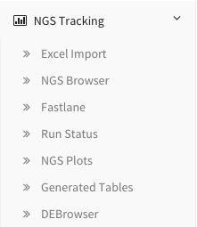
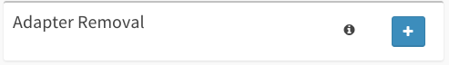
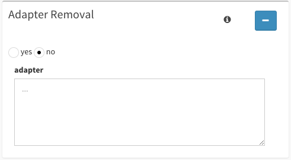

******************
NGS Pipeline Guide
******************

This guide will walk you through all of your options within the Run Pipeline page.

Getting Started
===============

First, make sure to have an instance of dolphin available (see Dolphin Docker) as well as an account for the dolphin interface.

Once logged in, click on the 'NGS Tracking' tab on the left, then click on 'NGS Browser'.

	
Once you have selected the samples/imports you wish to analyze, hit the 'Send to Pipeline' at the bottom of the screen to begin.

Alternatively, if you're rerunning a run with different parameters from the status page, you will be taken to the NGS Pipeline page.

NGS Pipeline Parameters
=======================

Once you've reached the pipeline page, there should be a table at the top of the page with your selection of samples from the browser.

You can explore this table further at your discretion, however the main portion of the page lies under the table within the tabs.

These tabs describe the parameters to the run you will be creating.

The first few tabs are required parameters, and they include:

**Name the Run:**

This parameter is a brief name you will be giving your run.

This will help you quickly identify which run is which within the status page.

**Description:**

This parameter is a brief description of the current run you will be creating.

This may help clear up any confusion that might be caused about the run in question later.

**Genome Build:**

From this dropdown menu, you'll be able to select the specific genome build you wish to use.

**Mate-paired:**

Use the dropdown menu to select whether or not your libraries are mate paired or not.

**Resume Run:**

Select whether this is a fresh run, or a continuation of a previous run.

**Output Directory:**

This determines where the specific output of the current run should be deposited within the system.

If you're not entirely sure as where to deposit your data, you can contact your local administrator.

User permissions are required within the cluster for the path that you select.  An error will show if you do not have proper permissions to add to/create this directory.

**FastQC:**

Select whether or not you want a FastQC report.

**Permissions:**

Select who will be able to view this run.

Options include:

* only me
* only my group
* everyone

**Group Selection:**

Select which group to submit this run under.

A list of all the groups you belong to will be provided.

**Submission:**

This will determine whether or not to prepare the run for submission to either ENCODE of GEO.

For now, this feature has been disabled.

Optional Parameters
===================

Further down the page, there are tabs with a plus sign on them.

	
By clicking on the plus sign, you expand the tab and have aditional parameter options to choose from.

	
The expandable tabs include:

**Split FastQ:**

If you would like the to split the resulting fastq files, you can expand the Split FastQ and select the yes button.

Once yes is selected, you then can select the size of the fastq file based on the number of reads per file.

**Quality Filtering:**

If your samples require quality filtering, you can expand the Quality Filtering tab and select the yes button.

After you've selected yes, you then can adjust the following quality filtering parameters:

* window size
* required quality
* leading
* trailing
* minlen

**Adapter Removal:**

If your samples require adapter removal, you can expand the Adapter Removal tab and select the yes button.

Once you've selected yes, you can then add your specific adapters within the adapter text box.

There should be one adapter per line within the text box.

**Trimming:**

If you would like to trim the reads within your samples selected, you can do so by expanding the Trimming tab and selecting the yes button.

Next, select whether or not the reads are paired-end or single-end.

After you've selected your read type, then enter the 5' length to trim and the 3' length to trim.

If paired-end reads are selected, additionally you need will need to supply the 5' and the 3' length of the pair too be trimmed.

**Custom Sequence Set:**

If you would like to add custom sequence sets, expand the Custom Sequence Set and select the 'Add a Custom Sequence Set' button.

For these custom sequence sets, you will have to supply:

* The custom sequence index directory (full path)
* Prefix of the index file (Example: for index.fasta you would supply 'index')
* Bowtie parameters
* Description of the index
* Whether to filter out the reads mapped to this custom index

Please remove all spacing from the naming of sequences within your .fasta file in order for the pipeline to properly prepare quantification tables.

You can add multiple custom sequence sets if desired.

**Common RNAs:**

If you would like to map your reads sequentially to common RNAs, Expand the Common RNAs tab and select the yes for the RNAs you would like to map.

Bowtie2 maps your reads sequentially to common RNAs below and then filters the reads mapped out. To change the default parameters, click the `Change Parameters` button and then insert your parameters.

Additional Pipelines
====================

If you would like to add additional features to your current run, you can expand the Additional Pipelines tab and hit the 'Add Pipeline' button.

You can add more than one selection of additional pipelines by clicking the 'Add Pipeline' button again.  You can also remove your current pipeline selection by clicking the 'Remove Pipeline' button.

The pipelines added will be carried out from top to bottom.

A new box will appear with a dropdown menu that includes:

**RNASeqRSEM:**

Selecting the RNASeqRSEM additional pipeline will run RSEM in addition to the current run.

RSEM is an additional pipeline that will estimate gene and isoform expression levels for RNA-Seq data.

Upon selection of RNASeqRSEM, you have the option of selecting additional RSEM command line parameters as well as IGC/TDF or BigWig conversions.

The RSEM pipeline also has an option to generate RSeQC reports.
For more information on the RSeQC reports, you can view the program used, 'read-distribution.py' for RSeQC,`here`_.

**Tophat:**

Selection the Tophat additional pipeline will allow you to run Tophat in addition to the current run.

Tophat is a popular RNA-seq alignment tool used for mapping and splice junction detection.

Upon selecting the Tophat pipeline addition, you have the option of adding additional tophat command line parameters as well as IGC/TDF or BigWig conversions.

The Tophat pipeline also has an option to generate RSeQC reports.
For more information on the RSeQC reports, you can view the program used, 'read-distribution.py' for RSeQC,`here`_.

.. _here: http://rseqc.sourceforge.net/#read-distribution-py

**ChipSeq:**

If your samples of interest include ChipSeq data, then the ChipSeq additional pipeline should be selected.

After selection of ChipSeq, some additional parameters are required.

Chip Input Definitions are the names of the files of your chipseq input.  Multimappers determines the maximum number of locations reads are allowed to map to.

Tag size, in base pairs, for MACS determines the size of the tags while the Band Width, in base pairs, for MACS determines the size of the sequenced regions.

The Effective genome size, in base pairs, is the size of the mappable part of the genome.

IGV/TDF and BigWig conversion is also selectable.

**DESeq:**

First, in order to select the DESeq additional pipeline option, you must have already selected the RNASeqRSEM option first.

The DESeq pipeline allows for differential expression analysis to be conducted amongst your samples.

Using the selection boxes labeled 'Condition 1' and 'Condition 2' you can select which samples you wish to check against.

Once you've selected your conditions, you then can determine your Fit Type, and p-adjustment cutoff value as well as whether or not you want the Heatmap and the Fold Change cutoff.

Based on your previous selection from the Common RNAs tab, you can also select which given sequences you want to analyze.

Note that you can select DESeq multiple times, incase you want to run multiple pairwise comparisons on a single run.

**BisulphiteMapping:**

If you would like to carry out Bisulphite mapping, then the BisulphiteMapping additional pipeline should be selected.

Bisulphite Mapping is a bisulphite sequencing mapping program that indexes only digestion sites.

In addition to running the BSMap program with it's additional parameters, the user can also run MCall with additional parameters to report statistics such as various bias, confidence intervals, and methylation ratios.

In order to run MethylKit, MCall must first be selected.

**DiffMeth:**

If you would like to carry out Differential Methylation, then the DiffMeth additional pipeline should be selected.

Differential Methylation lets you compare the Bisulphite Mapping results of samples against other samples within your run.

Using the selection boxes labeled 'Condition 1' and 'Condition 2' you can select which samples you wish to check against.

In order to carry out DiffMeth, the user first has to select the BisulphiteMapping pipeline, select the 'Run MCall' checkbox, and select the 'Run MethylKit' checkbox as they are required to carry out this step.

You may select DiffMeth multiple times, incase you want to run multiple pairwise comparisons on a single run.

**HaplotypeCaller:**

If you would like to use the Genome Analysis Toolkit's Haplotype Caller to detect SNP variants within your samples, the the HaplotypeCaller additional pipeline should be selected.

In order to run Haplotype Caller, you must have a Tophat pipeline or ChipSeq pipeline already within your list of pipelines in order to generate the bam files needed for this step.

HaplotypeCaller will output .vcf files which will contain possible variants in accordance with the genome selected.

Submission
==========

Once all of your parameters are squared away and you've selected all of the additional options/pipelines that you desire for your run, you may hit the 'Submit' button at the bottom left of the page to submit the run.